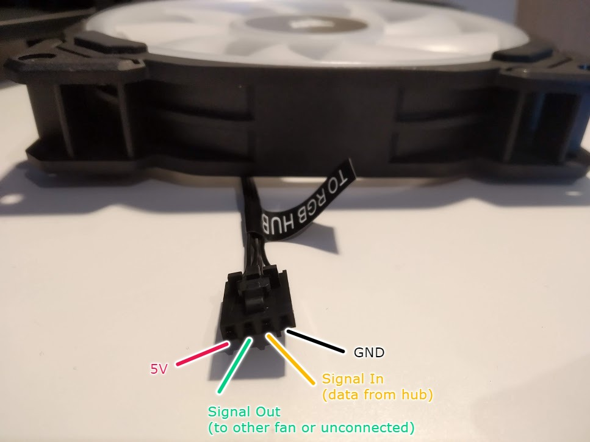

# Corsair LL140/LL120 RGB Fan

Here is a photo of the pinout for a Corsair LL140 or LL120 RGB Fan. (CO-9050071-WW, CO-9050072-WW, CO-9050073-WW, CO-9050074-WW)

Each fan contains 16 RGB LEDs, controlled with the same protocol as a WS2812B LED strip.

I haven't disassembled the fans themselves though, so I can't confirm.
I do know that connecting a WS2812B strip in series with a fan works as expected.

